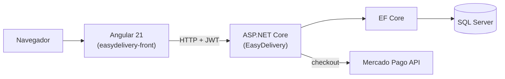

<div align="center">

# 🍔 EasyDelivery

**Sistema de gerenciamento de pedidos para restaurantes — full-stack ASP.NET Core + Angular**

[](https://dotnet.microsoft.com/)
[](https://angular.dev/)
[](LICENSE)

</div>

## 💡 O projeto

Aplicação completa — do banco de dados à interface — para gerenciar pedidos de restaurantes: cadastro de pedidos, acompanhamento e a **área do restaurante** para gestão. Projeto full-stack com autenticação **JWT** e integração de pagamentos via **Mercado Pago**.

## ⚙️ Arquitetura



Backend em **Clean Architecture**:

```
EasyDelivery.slnx
├── EasyDelivery/                 # 🌐 API (controllers, autenticação JWT)
├── EasyDelivery.Application/     # ⚙️ Casos de uso e serviços
├── EasyDelivery.Domain/          # 📦 Entidades e regras de negócio
├── EasyDelivery.Infrastructure/  # 🔌 EF Core, SQL Server, integrações
└── easydelivery-front/           # 💻 Front-end Angular 21
```

## 🚀 Como rodar (desenvolvimento)

**Backend** — configure o banco e as chaves via *user-secrets* ou variáveis de ambiente:

```bash
dotnet user-secrets set "Jwt:Key" "sua-chave"
dotnet user-secrets set "MercadoPago:AccessToken" "seu-token"
dotnet run --project EasyDelivery
```

**Frontend:**

```bash
cd easydelivery-front
npm install
npm start
```

> 🔐 **Segurança:** credenciais (JWT e Mercado Pago) ficam fora do versionamento — use *user-secrets* em dev e variáveis de ambiente em produção. A connection string padrão aponta para o **LocalDB** do SQL Server.

## 🧰 Stack

`.NET 10` · `ASP.NET Core` · `EF Core` · `SQL Server` · `Angular 21` · `TypeScript` · `JWT` · `Mercado Pago`

## 🗺️ Roadmap

- [ ] `docker compose` para subir a stack completa em um comando
- [ ] Testes de unidade no backend
- [ ] Screenshots das telas (pedido, área do restaurante)
- [ ] Badge de CI

## 📄 Licença

Distribuído sob a licença [MIT](LICENSE).
